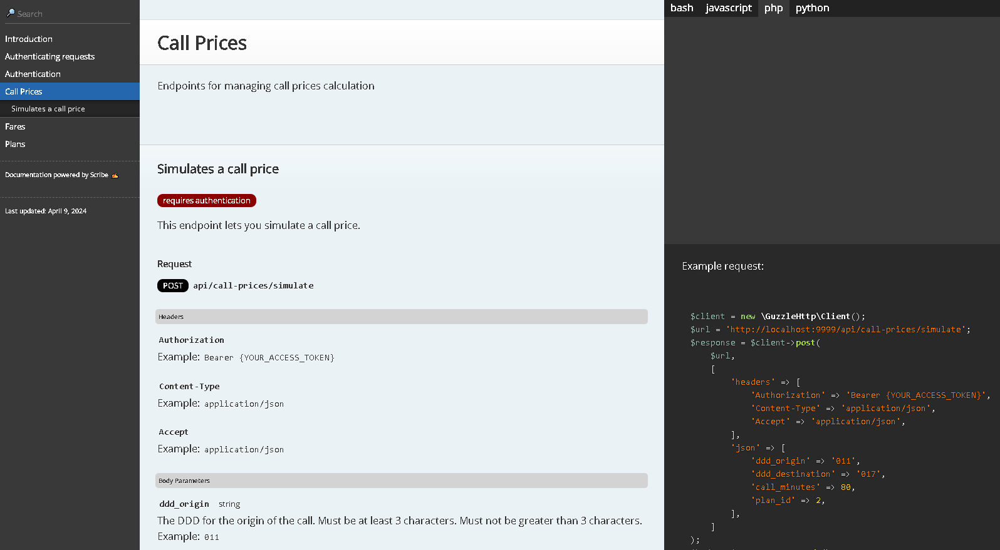

## Using the API

### Testing the API enpoints

To test the API endpoints you will need a program that can perform http requests. You can use **Postman** or **Insomnia**, for example.

[Postman](https://www.postman.com/downloads/)

[Insomnia](https://insomnia.rest/download)

### API documentation

The application provides a page generated with the package **Scribe** that contains details about all the *API endpoints*.



To access the page you have to use the following url:

```
http://localhost:9999/api-docs
```

Remember to starting up the application before try to access the API documentation page.

### Running tests

To run the tests of the application, you can use the following command on the terminal of the project:

```
docker-compose exec main php artisan test
```

If preferred, you can enter the container of *PHP* using the following command:

```
docker-compose exec -it main bash
```

And after that you can run the *artisan* command for tests.

```
php artisan test
```